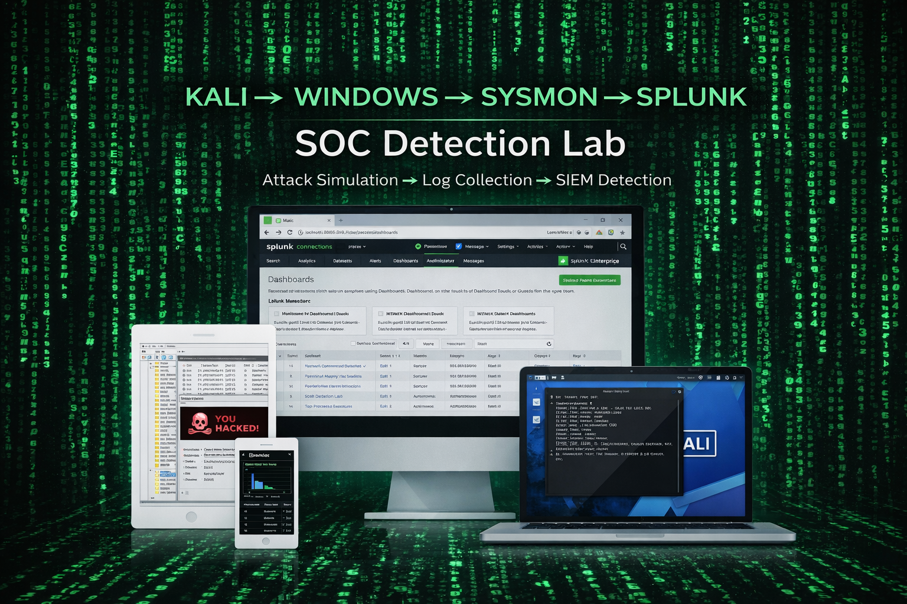

# Cybersecurity Portfolio

Welcome to my cybersecurity portfolio. This repository contains hands-on labs and projects demonstrating my skills in **security monitoring, threat detection, and SOC operations**.

I built a multiple labs to simulate attacks and investigate logs using industry tools such as **Splunk, Sysmon, and Kali Linux**.

---

## Skills Demonstrated

- SIEM Monitoring
- Threat Detection
- Log Analysis
- Sysmon Event Investigation
- Network Scan Detection
- Security Monitoring
- Incident Investigation
- Blue Team Analysis

---

## Tools & Technologies

- Splunk
- Sysmon
- Kali Linux
- Windows 10
- Nmap
- VirtualBox

---

## Projects

### SOC Lab – Splunk Security Monitoring Lab

This project documents my **home SOC lab environment** used to simulate attacks and detect suspicious activity using Splunk and Sysmon.

Topics covered:

- Lab architecture
- Virtual machine environment
- Splunk log ingestion
- Sysmon configuration
- Network scan detection
- Security monitoring workflow

---

### SOC Lab Screenshot

---

### View Project

➡️ **[SOC Lab Documentation](SOC-Lab/README.md)**

---

## Lab Environment

My SOC lab consists of three virtual machines:

**Attacker Machine**
- Kali Linux
- Used for attack simulation and network scanning

**Victim Machine**
- Windows 10
- Sysmon installed for enhanced logging

**SIEM**
- Splunk
- Used for log ingestion, monitoring, and analysis
