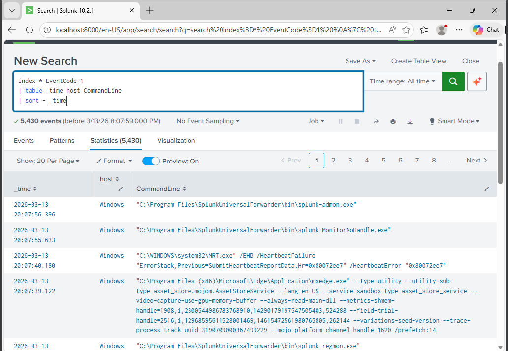

# Splunk – SOC Lab

This repository documents my hands-on cybersecurity labs focused on blue-team detection, threat hunting, and SIEM analysis using splunk.

## Skills Demonstrated
- SIEM Monitoring (Splunk)
- Sysmon Log Analysis
- Network Scan Detection
- Threat Hunting
- Log Ingestion
- Security Monitoring

## Lab Environment

3 Virtual Machines:

Attacker Machine
- Kali Linux
- Network scanning
- Attack simulation

Victim Machine
- Windows 10
- Sysmon installed
- Splunk Forwarder
- Event logs generated

SIEM Server
- Splunk
- Log ingestion
- Detection queries

## Example Detection

Detecting Nmap Network Scans using Sysmon Event ID 3 in Splunk.

## Tools Used

- Splunk
- Sysmon
- Kali Linux
- Network Scanning
- VirtualBox
